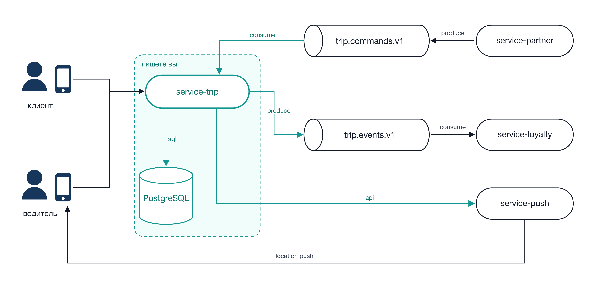

# TripGo — лабораторные работы курса

Учебный проект курса «Разработка микросервисов на Go». За пять лабораторных
работ вы доводите один сервис от пустого репозитория до состояния, в котором
его можно показывать на техническом собеседовании: HTTP и gRPC API, PostgreSQL
с транзакциями, чистая архитектура, тесты, observability, конкурентная
обработка, Kafka, паттерны устойчивости.

Все пять работ делаются **в одном репозитории**, каждая следующая продолжает
предыдущую. Переписывать сервис с нуля не нужно.

---

## Что мы строим

**TripGo** — MVP сервиса такси. Пассажир выбирает водителя и создаёт поездку.
Пока поездка активна, устройство водителя шлёт координаты, чтобы потом можно
было посмотреть маршрут. В конце водитель завершает поездку.

Если координата не приходила дольше настроенного времени, сервис сам запрашивает
её у устройства — шлёт команду в **Push Service**. Горутину на каждую поездку не
заводим, так как поездок ожидается много: опрос сделан через in-memory очередь и
worker pool.

В качестве сервиса пушей используется заглушка, почему за получением координаты идут запросы в сервис пушей
можно почитать статьи на тему Location Push ([например](https://developer.apple.com/documentation/corelocation/creating-a-location-push-service-extension)), похожий подход используется
в приложениях life360, teem.  



Зелёным выделено то, что пишете вы — `service-trip` и его бд. Остальные сервисы
на схеме уже готовы: `service-partner` шлёт команды на создание поездок,
`service-loyalty` консьюмит события о завершённых, в `service-push` мы ходим,
когда по поездке давно не было координат.

Что поднято в локальном окружении — в
[README репозитория `course-infra`](https://github.com/course-go-autumn-2026/course-infra).
Описание домена — [`docs/domain.md`](docs/domain.md).

---

## Дорожная карта

| № | После лекций | Тема | Баллы | Ориентир по времени |
|---|---|---|---|---|
| [1](tasks/01-http-and-postgres/) | 1–2 | HTTP API, PostgreSQL, менеджер транзакций | 12 | ~12 ч |
| [2](tasks/02-architecture-and-observability/) | 3–6 | Чистая архитектура, тесты, линтер, OpenTelemetry | 12 | ~12 ч |
| [3](tasks/03-positions-and-worker-pool/) | 7–8 | Координаты, очередь, worker pool | 15 | ~16 ч |
| | | **Итого здесь** | **39** | ~40 ч |

Дальше будут ещё две: gRPC с событиями в Kafka и паттерны устойчивости. Их
выдадут после соответствующих лекций, всего за курс 60 баллов.

За задания со звёздочкой в этих трёх работах можно набрать **5 баллов** сверх
основных, всего по курсу их на 8. Бонус не начисляется, если основная часть работы сделана не
полностью.

---

## С чего начать

Перед первой работой прочитайте
[`docs/getting-started.md`](docs/getting-started.md): как завести репозиторий и
модуль, поднять окружение, поставить инструменты, что такое миграции и как
выглядит сданная работа. В самих заданиях это не повторяется.

---

## Как устроена каждая работа

Все пять описаний сделаны по одной структуре, читать их надо целиком до начала
работы.

1. **Контекст** — что уже есть в репозитории к началу работы.
2. **Цель** — какой навык проверяется.
3. **Что нужно сделать** — пронумерованные шаги.
4. **Контракты** — API, схема БД, события. Менять их нельзя (см. ниже).
5. **Бизнес-правила** — как сервис обязан себя вести.
6. **Требования к реализации** — жёсткие технические ограничения.
7. **Как проверить себя** — команды и запросы до сдачи.
8. **Что сдавать** — ветка, PR, содержимое README.
9. **Критерии оценки** — побалльный чек-лист проверяющего.
10. **Со звёздочкой** — бонусные баллы.

---

## Контракты менять нельзя

`contracts/` — это внешние контракты сервиса: OpenAPI, protobuf, AsyncAPI, DDL.
Считайте, что их уже используют мобильные приложения и соседние команды.

**Изменение контракта равносильно ошибке в проде.** Если контракт неудобен или
в нём ошибка — не правьте его молча, напишите в чат курса. Обсудим и выпустим
новую версию для всех.

Добавлять новое можно: свои таблицы, свои внутренние структуры. Нельзя менять
уже опубликованное — переименовывать поля, менять типы, коды ответов и
статусы.

---

## Технологический стек

Стек зафиксирован. Это учебное ограничение: когда стек у всех одинаковый, ревью
получается предметным, а разбор ошибок на семинаре полезен сразу всем.

Два выбора, которые чаще всего вызывают вопросы:

- **`chi`, а не стандартный `net/http`.** С Go 1.22 стандартный `ServeMux` умеет
  и метод в паттерне, и path-параметры, так что для трёх ручек его хватило бы. Но
  дальше нужны цепочки middleware, группы роутов с общим префиксом и вложенные
  роутеры — этого в стандартной библиотеке нет, а к работе 2 ручек станет
  больше. `chi` при этом остаётся обычным `http.Handler`, то есть вы не
  прирастаете к фреймворку.
- **`squirrel`, а не строки.** Билдер не даёт склеить SQL конкатенацией и
  заставляет думать про плейсхолдеры. Писать запросы можно и без него, но тогда
  легко получить инъекцию там, где не ждёшь.

| Слой | Что используем |
|---|---|
| Язык | Go 1.24+ |
| HTTP-роутер | `net/http` + `github.com/go-chi/chi/v5` |
| Кодогенерация HTTP | `github.com/oapi-codegen/oapi-codegen/v2` |
| PostgreSQL | `github.com/jackc/pgx/v5` (`pgxpool`) |
| SQL-билдер | `github.com/Masterminds/squirrel` |
| Миграции | `github.com/pressly/goose/v3` |
| Логи | `log/slog` (JSON handler) |
| Метрики, трейсы | `go.opentelemetry.io/otel` + OTLP exporter |
| Тесты | `testing`, `github.com/stretchr/testify`, `go.uber.org/mock` (gomock) |
| Утечки горутин | `go.uber.org/goleak` |
| Линтер | `golangci-lint` |
| gRPC | `google.golang.org/grpc`, `protoc` / `buf` |
| Брокер | Redpanda (протокол Kafka), клиент `github.com/twmb/franz-go` |

Заменить библиотеку на аналог можно только по согласованию в чате курса до сдачи
работы. Если заменить молча, проверяющий не сможет проверить то, что задумано, а
значит по соответствующему пункту чек-листа будет минус.

---

## Что мы даём готовым

- **Локальное окружение** — PostgreSQL, Redpanda, OpenTelemetry Collector,
  Prometheus, Grafana, Jaeger. Поднимается утилитой `tripgoctl`, состав зависит
  от работы.
- **Push Service** — заглушка с HTTP-интерфейсом. Умеет отвечать медленно и с
  ошибками — пригодится, когда будете проверять устойчивость.
- **Контракты** — `contracts/`.
- **Каталог метрик** — `docs/observability.md`.

Что внутри окружения и откуда брать адреса —
[`docs/environment.md`](docs/environment.md).

Код сервиса, миграции, схему бд, тесты, Makefile, Dockerfile пишете вы.

---

## Общие правила

- Работа ведётся в вашем личном репозитории, ссылку сдаёте один раз перед лабораторной работой 1.
- Каждая работа — отдельная ветка `homework/01` … `homework/05` и Pull Request
  в `main`. PR не мержим до проверки.
- В PR должно быть описание: что сделано, какие решения приняты и почему, что
  не успели.
- Мёржим PR только после того, как работа принята.

Сквозные требования к коду, которые проверяются в **каждой** работе начиная с
указанной, — [`docs/conventions.md`](docs/conventions.md).

Шкала оценки, защита и дедлайны — [`docs/grading.md`](docs/grading.md).

---

## Состав репозитория

```
README.md                этот файл
docs/
  domain.md              домен, сущности, жизненный цикл поездки, глоссарий
  conventions.md         сквозные требования к коду
  observability.md       каталог логов, метрик и трейсов
  getting-started.md     что сделать перед первой работой
  environment.md         из чего состоит окружение и откуда брать адреса
  grading.md             как оценивают, защита, дедлайны
contracts/
  schema.md              таблицы бд: поля, типы, ограничения
  openapi/               HTTP-контракты
  sql/                   подсказки по ключевым запросам
config/                  примеры env-файлов и конфиг линтера
assets/                  схемы и макеты интерфейсов
tasks/                   лабораторные работы
```
