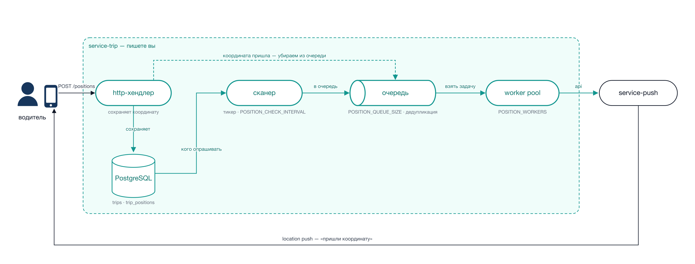

# Лабораторная работа 3. Координаты, очередь и worker pool

---

## Окружение

Скопируйте [`environment.toml`](environment.toml) работы 3 в корень своего
репозитория, поднимите окружение: `tripgoctl environment start`, затем
`tripgoctl connect`. Добавляется заглушка пушей — её адрес берите из `.env`, а
логи смотрите через `tripgoctl environment logs push-service`: по ним видно, что
команда дошла.

Подробности — [`docs/environment.md`](../../docs/environment.md).

**Перед началом.** Кроме этого файла действуют все разделы из
[`docs/conventions.md`](../../docs/conventions.md). В чек-листе они не
продублированы, но на ревью их смотрят. Если работаете первый раз —
начните с [`docs/getting-started.md`](../../docs/getting-started.md).

## 1. Контекст

Сервис умеет вести поездки, разложен по слоям и покрыт тестами. Теперь добавляем
маршрут.

Пока поездка активна, устройство водителя шлёт координаты. Но связь рвётся,
приложение уходит в фон, садится батарея, и координаты перестают приходить. Если
по поездке давно не было координат, сервис сам запрашивает её у устройства через
Push Service. Механика называется location push, у Apple под неё есть отдельное
[расширение](https://developer.apple.com/documentation/corelocation/creating-a-location-push-service-extension);
так же будят устройства life360 и teem.

Сейчас нагрузки нет, поездок мало, и горутина с таймером на каждую поездку
работала бы нормально. Но по продуктовым планам активных поездок будет несколько
десятков тысяч на под, и на таком объёме эта схема не живёт. Переделывать потом
дороже, чем сделать сразу, поэтому опрос делаем через сканер по тикеру,
ограниченную очередь и пул воркеров фиксированного размера.

Это самая объёмная работа курса, начинайте заранее.



Зелёным — то, что вы делаете в этой работе. Сканер по тикеру забирает из бд
поездки без свежих координат и складывает их в ограниченную очередь, пул воркеров
разбирает её и ходит в `service-push`. Если по поездке пришла координата, хендлер
убирает её из очереди, а после отправленной команды выдерживается пауза, чтобы не
слать их подряд по одной поездке.

## 2. Цель

**Что будет уметь сервис.** Принимать координаты и отдавать маршрут поездки. В
фоне сканер находит поездки, по которым координат давно не было, и через
ограниченную очередь и пул воркеров просит устройство прислать координату. При
остановке сервиса задачи не теряются, горутины не остаются.

**Что на этом отрабатываем:**

- проектировать конкурентную обработку без горутины-на-сущность;
- строить worker pool с ограниченной очередью и осмысленным поведением при
  переполнении;
- защищать разделяемое состояние и доказывать это тестами с `-race`;
- корректно останавливать связку «тикер → очередь → воркеры» по контексту, не
  теряя задачи и не оставляя горутин;
- ходить во внешний сервис через гейтвей за интерфейсом.

## 3. Что нужно сделать

1. **Миграция**: колонка `last_position_at` в `trips` и таблица
   `trip_positions` — состав полей в [`domain.md`](../../docs/domain.md),
   п. 3.2.
2. **Ручка сохранения координаты** `POST /api/v1/trips/{tripId}/positions`.
3. **Ручка получения маршрута** `GET /api/v1/trips/{tripId}/positions`.
4. **Запрос выборки поездок для опроса** — один SQL, который отдаёт только то,
   что надо опросить (п. 5.2).
5. **Сканер**: фоновая горутина с тикером, которая на каждом тике забирает эту
   выборку и ставит поездки в очередь (п. 5.3).
6. **Очередь и worker pool**: ограниченная очередь, фиксированное число
   воркеров, дедупликация, отмена по пришедшей координате (п. 5.4).
7. **Гейтвей в Push Service** по HTTP, за интерфейсом, с таймаутом (п. 5.5).
8. **Метрики** пула и проверок из
   [`docs/observability.md`](../../docs/observability.md).
9. **Тесты на конкурентность**: `-race`, `goleak`, подменяемое время (п. 7).

## 4. Контракты

### 4.1. Сохранение координаты

```http
POST /api/v1/trips/{tripId}/positions
Content-Type: application/json

{
  "coordinates": { "latitude": 59.9350, "longitude": 30.3350 },
  "recorded_at": "2026-08-24T12:00:05Z"
}
```

```http
HTTP/1.1 201 Created

{
  "id": 42,
  "trip_id": "1f0a9c62-4a1c-4f2e-9d33-2a4bb0f0b111",
  "coordinates": { "latitude": 59.9350, "longitude": 30.3350 },
  "recorded_at": "2026-08-24T12:00:05Z"
}
```

| HTTP | `code` | Когда |
|---|---|---|
| `400` | `invalid_request` | координаты вне диапазона, `recorded_at` не разобрался или в будущем более чем на минуту |
| `404` | `trip_not_found` | поездки нет |
| `409` | `trip_completed` | поездка уже завершена — координаты не принимаются |

### 4.2. Получение маршрута

```http
GET /api/v1/trips/{tripId}/positions
```

```json
{ "positions": [ { "id": 42, "trip_id": "...", "coordinates": {...}, "recorded_at": "..." } ] }
```

Фильтров и пагинации нет, ручка отдаёт все точки маршрута сразу. Сортировка — по
`recorded_at`, затем по `id`, по возрастанию.

### 4.3. Push Service

HTTP-контракт заглушки —
[`contracts/openapi/push-service.openapi.yaml`](../../contracts/openapi/push-service.openapi.yaml).
В этой работе используем `kind = "REQUEST_POSITION"`, `recipient_id` —
`driver_id` поездки, в `data` кладём `trip_id`.

На gRPC перейдём в лабораторной работе 4 — сейчас намеренно ходим по HTTP.

## 5. Требования к реализации

### 5.1. Сохранение координаты

`INSERT` в `trip_positions` и обновление `trips.last_position_at` выполняются
**в одной транзакции**, через `TxManager` из лабораторной работы 1:

```sql
UPDATE trips
SET last_position_at = GREATEST(COALESCE(last_position_at, $2), $2),
    updated_at = now()
WHERE id = $1 AND status = 'active';
```

`GREATEST` нужен потому, что координаты приходят не по порядку, и старая
координата, доехавшая позже свежей, не должна состарить поездку. На защите про
это спросят.

Разбор этого и других мест, где легко ошибиться в запросах, —
[`contracts/sql/queries.md`](../../contracts/sql/queries.md).

### 5.2. Выборка поездок для опроса

В памяти состояние поездок не держим. Каждый тик сканер берёт нужные поездки
прямо из бд одним запросом. Запрос пишете сами, он должен отбирать поездки, у
которых одновременно:

- статус `active`;
- с момента последней координаты прошло больше `POSITION_STALE_AFTER`. Если
  координат не было ни одной, отсчитываем от `started_at`.

Условие по времени считается в SQL, а не в Go: сканер получает готовый список и
сразу кладёт его в очередь.

Отметку о том, что команду уже слали, мы нигде не храним. Значит, если устройство
не ответило, поездка попадёт в выборку и на следующем тике — то есть повторный
запрос уйдёт через `POSITION_CHECK_INTERVAL`. Период тикера и есть та пауза,
через которую устройство получит второй пуш, поэтому ставить его в секунду
нельзя.

Первыми опрашиваем те поездки, по которым координат нет дольше всех.

Под этот запрос нужен индекс — без него на каждом тике будет seq scan по всей
таблице. Индекс придумываете сами: смотрите, по каким колонкам идёт фильтрация,
и проверяйте результат через `EXPLAIN (ANALYZE)`.

### 5.3. Сканер

Одна фоновая горутина с `time.Ticker` и периодом `POSITION_CHECK_INTERVAL`. На
каждом тике выполняет запрос из п. 5.2 и ставит полученные поездки в очередь.

Результат каждой постановки учитывается в `tripgo.stale_checks`:

| Что произошло | Метрика |
|---|---|
| поездка уже стоит в очереди, повторно не ставим | `result=duplicate` |
| поставили в очередь | `result=queued` |
| очередь заполнена, задача дропнута | `result=dropped` |

Сканер не должен блокироваться: если очередь заполнена, задача дропается,
инкрементится `tripgo.position_requests{result="dropped"}` и пишется лог уровня
`Warn`. Запись в очередь не должна блокировать сканер: иначе один медленный Push
Service остановит проверку всех поездок.

Тики не должны накладываться друг на друга: если обход не успел закончиться до
следующего тика, второй обход параллельно не запускаем.

### 5.4. Очередь и worker pool

Сканер, очередь и воркеры — один компонент, живут в `internal/worker/positions/`
по раскладке из работы 2. Гейтвей в Push Service — в `internal/gateway/push/`.

- Очередь — буферизованный канал ёмкостью `POSITION_QUEUE_SIZE`.
- Воркеров `POSITION_WORKERS`, они запускаются при старте и живут до
  остановки сервиса. Горутину на задачу не создаём.
- Дедупликация: одна поездка не может находиться в очереди дважды. Канала для
  этого недостаточно, нужна структура «сейчас в очереди», которую сканер проверяет
  перед постановкой, а воркер чистит после обработки. Она же защищает от того, что
  следующий тик придёт раньше, чем воркеры разобрали предыдущую порцию.
- Отмена: когда приходит координата, хендлер убирает поездку из этой структуры и
  из очереди. Задача, которая уже лежит в канале, при обработке отбрасывается —
  воркер видит, что поездки в «сейчас в очереди» больше нет, и в Push Service не
  идёт.
- Доступ к структуре синхронизирован: в неё одновременно пишут сканер, воркеры и
  хендлеры координат.
- Каждая задача обрабатывается с таймаутом `PUSH_REQUEST_TIMEOUT`.

Конфигурация — из env, значения по умолчанию:

```
POSITION_CHECK_INTERVAL=30s
POSITION_STALE_AFTER=60s
POSITION_WORKERS=4
POSITION_QUEUE_SIZE=100
PUSH_HTTP_URL=<генерируется tripgoctl в .env>
PUSH_REQUEST_TIMEOUT=1s
```

### 5.5. Гейтвей в Push Service

- Интерфейс объявлен в пакете-потребителе, реализация — в
  `internal/gateway/push`, по раскладке из работы 2.
- Собственный `http.Client` с таймаутами, без `http.DefaultClient`.
- Тело ответа закрывается всегда; ошибки транспорта и коды `4xx`/`5xx`
  различаются.
- Ретраев и rate limiter здесь нет, это лабораторная работа 5. Делаем одну
  попытку, ошибку логируем и учитываем в метрике.

### 5.6. Упрощения

Два места, где мы сознательно делаем проще, чем в проде. Знать про них надо: на
защите спросим, чем они плохи.

1. **Выборка идёт без `LIMIT`**, за раз тянем все подходящие поездки. При
   десятках тысяч поездок это тяжёлый запрос, и большая часть результата всё
   равно не влезет в очередь. Правильно читать батчами, с `LIMIT` и продолжением
   с последнего ключа. Это задание со звёздочкой, см. п. 10.
2. **Отметку об отправленной команде не храним.** Если устройство не ответило,
   поездка попадёт в выборку и на следующем тике, поэтому период тикера и есть
   пауза между повторными пушами. В проде хранят время последней отправки и
   разводят эти два интервала.

### 5.7. Остановка

Порядок остановки фиксирован и должен быть виден в коде:

1. HTTP-сервер перестаёт принимать запросы и дожидается текущих;
2. сканер останавливается — новые задачи не появляются;
3. воркеры дорабатывают то, что уже в очереди, в пределах общего
   `SHUTDOWN_TIMEOUT`;
4. закрываются HTTP-клиент и пул БД.

После остановки не должно остаться ни одной горутины сервиса, это проверяется
`goleak`.

## 6. Что должно быть видно в телеметрии

`tripgo.stale_checks{result}`,
`tripgo.position_requests.queue.size`,
`tripgo.position_requests.workers.active`,
`tripgo.position_requests{result}`, `tripgo.position_requests.duration`,
`tripgo.positions.saved`.

Вызов Push Service — отдельный спан. Спан обработки задачи воркером связываем со
спаном проверки через span link, а не через родителя, так как обработка идёт
асинхронно и переживает исходный запрос.

## 7. Тесты

Обязательные сценарии:

1. интеграционный на запрос из п. 5.2: свежая и завершённая поездки в выборку не
   попадают, а поездка без координат попадает;
2. поездка, уже стоящая в очереди, повторным тиком туда не добавляется;
3. приход координаты между постановкой и обработкой отменяет отправку;
4. переполнение очереди даёт `dropped`, а не блокировку сканера;
5. пул обрабатывает N задач `POSITION_WORKERS` воркерами;
6. по отмене контекста сканер и воркеры завершаются, горутин не остаётся;
7. ошибка Push Service не роняет воркер, следующая задача обрабатывается;
8. интеграционный: сохранение координаты обновляет `last_position_at` и
   атомарно откатывается при ошибке.

Требования:

- время подменяемо: тесты не ждут реальные 30 секунд, тикер прячем за интерфейсом
  и в тестах подставляем управляемую реализацию. `time.Sleep` для синхронизации не
  используем;
- `go test -race ./...` чистый;
- `goleak.VerifyTestMain` в пакетах с фоновыми компонентами.

## 8. Как проверить себя

```bash
make test && make lint && tripgoctl environment start && make run

# создать поездку, дальше не слать координаты
# через POSITION_STALE_AFTER в логах Push Service появляется REQUEST_POSITION,
# не чаще одного раза за POSITION_CHECK_INTERVAL
tripgoctl environment logs push-service

# слать координаты каждые 5 секунд — команд быть не должно
while true; do
  curl -sS -X POST localhost:8080/api/v1/trips/$TRIP_ID/positions \
    -H 'content-type: application/json' \
    -d "{\"coordinates\":{\"latitude\":59.93,\"longitude\":30.33},\"recorded_at\":\"$(date -u +%FT%TZ)\"}" > /dev/null
  sleep 5
done
```

Проверьте также:

- 200 активных поездок без координат при `POSITION_QUEUE_SIZE=10` — растёт
  `dropped`, сервис отвечает, память не растёт бесконечно;
- задайте заглушке задержку через admin API и убедитесь, что сканер продолжает
  тикать, а HTTP-ручки отвечают быстро; после проверки сбросьте настройку:

```bash
curl -fsS -X POST "$PUSH_ADMIN_URL/admin/behaviour" \
  -H 'content-type: application/json' -d '{"latency_ms":5000}'
# проверка сервиса
curl -fsS -X POST "$PUSH_ADMIN_URL/admin/behaviour" \
  -H 'content-type: application/json' -d '{"latency_ms":0}'
```

- рестарт сервиса с активными поездками — опрос продолжился сам, ничего
  прогревать не надо;
- `SIGTERM` под нагрузкой — процесс вышел в пределах `SHUTDOWN_TIMEOUT`,
  `goleak` в тестах молчит.

## 9. Что сдавать

Ветка `homework/03`, PR в `main`. В PR:

- миграция, две ручки, сканер, пул, гейтвей, тесты;
- в README сервиса — раздел «Опрос устаревших поездок»: схема
  «сканер → очередь → воркеры → Push Service», все параметры
  конфигурации и что произойдёт при исчерпании очереди;
- в описании PR — скриншот метрик пула под нагрузкой.

## 10. Критерии оценки

### Чек-лист — 11 баллов

| # | Что проверяется | Баллы |
|---|---|---|
| 1 | Миграция и обе ручки координат по контракту: коды, валидация, сортировка в выдаче маршрута | 1 |
| 2 | Сохранение координаты атомарно обновляет `trip_positions` и `trips.last_position_at` через `TxManager`, старая координата не «состаривает» поездку | 1 |
| 3 | Запрос выборки из п. 5.2 отбирает нужные поездки, условие по времени считается в SQL, завершённые и свежие не попадают | 1 |
| 3a | Под запрос выборки создан индекс своей миграцией, `EXPLAIN` показывает index scan, а не seq scan | 1 |
| 4 | Сканер: одна горутина с тикером, период из env, тики не накладываются, результат каждой постановки виден в `tripgo.stale_checks` | 2 |
| 5 | Worker pool: фиксированное число воркеров, ограниченная очередь, дедупликация, пауза между запросами, неблокирующая постановка с `dropped` | 2 |
| 6 | Гейтвей Push Service за интерфейсом, свой `http.Client` с таймаутом, корректная обработка кодов и закрытие тела | 1 |
| 7 | Остановка по п. 5.7: порядок соблюдён, задачи не теряются, `goleak` и `-race` зелёные | 1 |
| 8 | Метрики п. 6 и тесты п. 7, включая подменяемое время и сценарии переполнения и отмены | 1 |

Пункт 5 в этой работе основной.

### Защита — 4 балла

| Вопрос | Баллы |
|---|---|
| Почему не горутина на поездку; что произойдёт при 100 000 активных поездок в вашей схеме и в наивной | 1 |
| Как гарантируется, что одна поездка не окажется в очереди дважды; покажите место в коде и объясните, почему там нет гонки | 1 |
| Graceful shutdown: порядок остановки компонентов и что сломается, если остановить их в обратном порядке | 1 |
| Что происходит, когда Push Service отвечает 5 секунд, а тик — раз в 5 секунд | 1 |

## 11. Со звёздочкой

| Задание | Баллы |
|---|---|
| Выборка батчами вместо одного запроса на все поездки | +1 |
| Приоритетная очередь: первыми опрашиваем тех, кто молчит дольше | +1 |

### Выборка батчами

Убираем упрощение из п. 5.2: сканер перестаёт тянуть все подходящие поездки
разом. Требования:

- размер батча задаётся через env;
- продолжение идёт по ключу последней прочитанной строки, а не через `OFFSET`;
- за один тик сканер либо разбирает все батчи, либо останавливается, когда
  очередь заполнилась, и на следующем тике начинает заново;
- по метрике видно, сколько строк прочитано за тик;
- есть тест: при 250 подходящих поездках и батче в 100 сканер сделал три
  запроса и не пропустил ни одной поездки.

### Приоритетная очередь

Сейчас очередь — обычный буферизованный канал, порядок в нём FIFO. При
переполнении дропается то, что не влезло, и поездка, молчащая час, может
проиграть только что протухшей.

Задание: первыми опрашивать поездки, по которым координат нет дольше всех.
Канала для этого мало, нужна другая структура. Что проверяем:

- при заполненной очереди более «старая» поездка вытесняет более свежую, а не
  дропается сама;
- дедупликация и отмена по пришедшей координате продолжают работать;
- доступ синхронизирован, `-race` чистый;
- есть тест на порядок: кладём три поездки вперемешку, воркер забирает их в
  порядке возрастания времени последней координаты.
